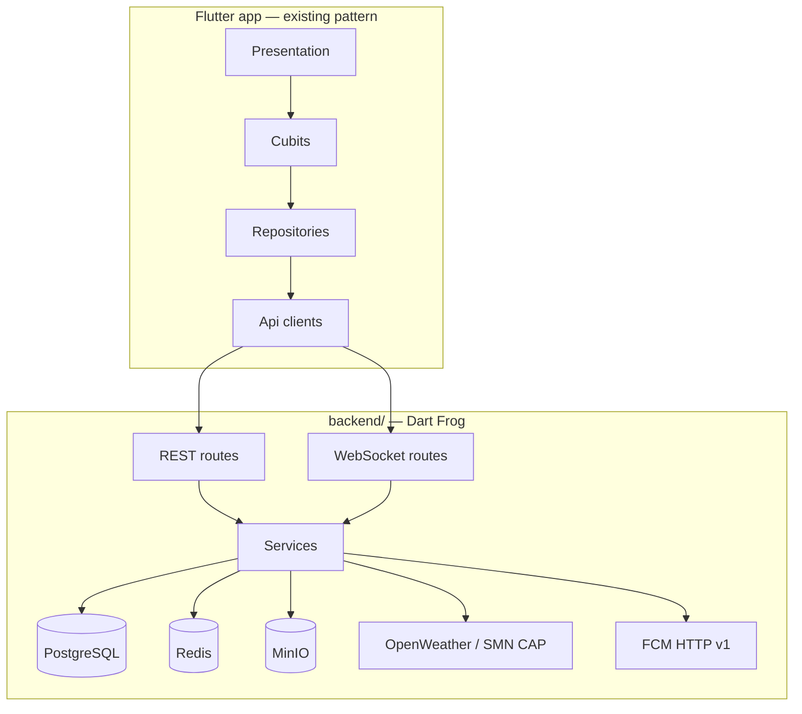

# feat: backend for weather, social, and hybrid zone sync — Standard

## Overview

Add a **self-hosted Dart backend** (no Serverpod) to Dónde Volar, extending the existing offline-first drone map app with:

1. **Weather data** — current conditions, wind, hourly forecast, and SMN alerts for Argentina
2. **Social platform** — profiles, posts, follows, comments, DMs, group chats, flight logs, and community feed
3. **Hybrid zone sync** — bundled offline zones remain the safety baseline; backend publishes live updates
4. **Push notifications** — follows, messages, comments, and weather alerts via FCM/APNs

The Flutter app keeps its VGV layered architecture (`*_api_client` → `*_repository` → Cubit → UI). The backend is a separate **`backend/`** Dart Frog project deployed via Docker on the operator's home server.

## Problem Statement / Motivation

Today the app is a standalone utility: zone verdicts run locally, there is no user identity, and weather is absent. Pilots increasingly want to:

- Check **wind and alerts** before flying (RAAC 100 prohibits "condiciones meteorológicas adversas")
- **Share flight spots** and experiences with other Argentine pilots
- **Stay updated** on zone data without waiting for an app store release

A backend unlocks community features while preserving the core offline safety path.

## Proposed Solution

### Architecture (high level)



### Stack (explicitly no Serverpod)

| Layer | Choice | Rationale |
|-------|--------|-----------|
| HTTP framework | **Dart Frog** | File-based routes, middleware, WebSocket support; community-maintained |
| Realtime | `dart_frog_web_socket` + Redis pub/sub | DMs and group chat fan-out |
| Database | **PostgreSQL 16** via `postgres` package | Relational social graph, migrations via `dbmate` or raw SQL files |
| Cache / pub-sub | **Redis 7** | Weather cache, session denylist, WebSocket fan-out |
| Media | **MinIO** (S3-compatible) | Photos/videos on home server; presigned uploads |
| Auth | JWT access + refresh tokens; `jose` for verify | Email/password + Google + Apple ID token verification server-side |
| Push | `firebase_cloud_messaging_dart` | Server-side FCM relay (APNs via FCM for iOS) |
| Weather upstream | **OpenWeather One Call 3.0** + **SMN CAP RSS** | Covers current, hourly, and Argentina alerts in one MVP stack |
| Deployment | **Docker Compose** + **Caddy** (TLS) | Home server: API, Postgres, Redis, MinIO |

### Deployment topology

**Single operator-hosted home server** — one shared community instance. The app ships with a default production base URL; power users may override in settings (with certificate pinning / TOFU warning).

- Map + offline verdict: **no account required** (regression guard)
- Weather sync, social, messaging, zone live updates: **account required**

### Zone data — hybrid (recommended)

Keep the existing client merge semantics in `FlightRulesRepository.load` and `RemoteZonesApiClient`:

| Source | Role |
|--------|------|
| Bundled snapshot (app) | Always present; offline safety baseline |
| Backend `GET /v1/zones` | GeoJSON feed + `zone_version` / ETag; overlays bundled by `id` |
| ANAC MADHEL refresh | Backend cron job ingests; publishes to zone feed |

When server fetch fails, client uses last cached sync with visible `last_updated` banner.

### Weather — recommended defaults

Weather is an **advisory layer**, not a hard fly/no-fly gate (RAAC 100 has no numeric thresholds).

| Field | Source | Use |
|-------|--------|-----|
| Wind speed, direction, gusts | OpenWeather One Call 3.0 | Map overlay + advisory scoring |
| Hourly forecast (48h) | OpenWeather One Call 3.0 | Planning strip on map card |
| SMN alerts | OWM `alerts[]` + SMN CAP RSS backup | Push triggers + "not recommended" floor |
| Multi-altitude wind (later) | Open-Meteo commercial | Optional v1.1 for BVLOS pilots |

**Advisory bands (light drones, ≤250 g):**

| Level | Sustained wind | Gusts |
|-------|----------------|-------|
| Good | ≤ 5 m/s | ≤ 7 m/s |
| Caution | 5–8 m/s | ≤ 10 m/s |
| High caution | 8–10.7 m/s | ≤ 12 m/s |
| Not recommended | > 10.7 m/s or active SMN alert | > 12 m/s |

Server computes `WeatherAdvisoryLevel` in the proxy; keys never ship to the client.

### Social feature scope (full v1)

| Feature | Details |
|---------|---------|
| **Profiles** | Public by default: handle, display name, bio, avatar, post grid, follower counts |
| **Follow** | User-configurable: open follow OR approval required |
| **Posts** | Caption, photos, videos (≤60 s / ≤50 MB v1), optional map pin (fuzzed ~500 m), embedded fly verdict snapshot |
| **Comments** | On posts (required — push mentions comments) |
| **Flight logs** | Private by default; optional "Share to feed" creates post referencing log |
| **Feed** | Chronological, posts from followed users |
| **DMs** | 1:1 threads, text + images v1 |
| **Group chats** | Create, add/remove members, admin role for group owner |
| **Moderation** | Report post/user/message; admin hide via CLI or minimal web UI |

### Fly verdict embed — server validation

Posts claiming an embedded verdict must include assessment inputs:

```json
{
  "lat": -34.6037,
  "lon": -58.3816,
  "permissionId": "recreational",
  "modalityId": "vlos",
  "altitudeRangeMetersAgl": { "min": 0, "max": 120 },
  "zoneVersion": "2026-06-02T12:00:00Z",
  "assessedAt": "2026-06-02T14:30:00Z"
}
```

Server **re-runs `assess()`** with the same zone dataset version and stores only the server-computed snapshot. Reject mismatches. Display stale badge when `zone_version` has changed since assessment.

## Technical Considerations

### Monorepo layout

```
where_to_fly/
  lib/                              # existing Flutter app
  packages/
    auth_api_client/                # NEW
    auth_repository/                # NEW
    social_api_client/              # NEW
    social_repository/              # NEW
    weather_api_client/             # NEW
    weather_repository/             # NEW
    messaging_api_client/           # NEW (REST + WebSocket)
    messaging_repository/           # NEW
    flight_rules_repository/        # extend: server zone feed client
  backend/                          # NEW — Dart Frog project
    routes/
      index.dart                    # health
      v1/
        auth/[...].dart
        weather/index.dart
        zones/index.dart
        users/[id].dart
        posts/[...].dart
        follows/[...].dart
        messages/[...].dart
        groups/[...].dart
        ws.dart                     # WebSocket upgrade
    lib/
      middleware/auth.dart
      services/
        auth_service.dart
        weather_service.dart
        zone_ingest_service.dart
        post_service.dart
        messaging_service.dart
        notification_service.dart
      db/                           # SQL migrations + query helpers
    docker-compose.yaml
    Dockerfile
    Caddyfile
```

Wire new repositories in `lib/bootstrap.dart` alongside existing ones.

### Authentication

- **Email + password**: bcrypt hash in Postgres; email verification required before posting
- **Google / Apple OAuth**: verify ID tokens server-side with `jose`; link accounts by verified email
- **Sign in with Apple**: required on iOS wherever Google is offered
- **Tokens**: short-lived JWT access (15 min) + refresh (30 days, rotatable); store refresh token hash in DB
- **Rate limits**: login 5/min/IP; signup 3/hour/IP

### Realtime messaging

- WebSocket at `wss://<host>/v1/ws` — authenticated via query token or `Sec-WebSocket-Protocol`
- Redis pub/sub channels: `thread:{id}`, `user:{id}` for fan-out across API instances
- Message delivery ack: client marks sent only after server `message_id` response
- Offline: client outbox queue; sync on reconnect

### Media uploads

1. Client `POST /v1/media/upload-url` → presigned MinIO PUT URL + `media_id`
2. Client uploads directly to MinIO
3. Client `POST /v1/media/{id}/confirm` → server verifies object exists, stores metadata
4. Max v1: 50 MB video, 10 MB photo; client-side compression encouraged

### Push notifications

| Trigger | Deep link |
|---------|-----------|
| New follower | `/profile/{handle}` |
| Follow request | `/profile/{handle}/requests` |
| New comment | `/posts/{id}` |
| DM / group message | `/messages/{threadId}` |
| Weather alert | `/map?lat=&lon=` |

Store `device_tokens` per user/device; unregister on logout. Per-category toggles in user settings.

### Home server ops

- **Caddy**: automatic Let's Encrypt; stable domain required for OAuth redirects
- **Backups**: nightly `pg_dump` + MinIO bucket sync to external disk
- **Health**: `GET /health` returns `{ version, zone_feed_version, min_client_version }`
- **Disk quotas**: alert at 80% — video storage is the main risk on residential uplink
- **Abuse**: rate limits on uploads and signup; optional fail2ban on auth routes

### Security

- TLS required in production; no cleartext except `--dart-define=DEV_HTTP=true`
- API keys (OpenWeather) server-side only
- Location pins fuzzed on public posts (~500 m)
- Block/mute users (minimal v1 safety)
- Account deletion: hard-delete profile + posts; anonymize DMs or delete per user choice

### Performance

- Weather cache: 15 min TTL keyed by rounded lat/lon (2 decimal places)
- Zone feed: ETag / `If-None-Match`; delta updates when feed grows
- Feed pagination: cursor-based, 20 posts per page

## Implementation Phases

Although the target is full v1, build in dependency order:

### Phase 1 — Backend foundation
- [ ] Scaffold `backend/` Dart Frog project + Docker Compose (Postgres, Redis, MinIO, Caddy)
- [ ] DB migrations: users, sessions, device_tokens
- [ ] Auth routes: signup, login, refresh, OAuth (Google, Apple), password reset
- [ ] Health endpoint + structured logging
- [ ] `auth_api_client` + `auth_repository` in Flutter; login/signup screens

### Phase 2 — Weather + zones
- [ ] `WeatherService`: OpenWeather proxy + SMN CAP parser + Redis cache + advisory scoring
- [ ] `GET /v1/weather?lat=&lon=` endpoint
- [ ] Zone ingest cron: MADHEL refresh → publish GeoJSON + `zone_version`
- [ ] `GET /v1/zones` with ETag support
- [ ] `weather_api_client`, `weather_repository`; weather card on map
- [ ] Extend `FlightRulesRepository` to consume backend zone feed (hybrid merge)
- [ ] Weather alert subscriptions + push worker

### Phase 3 — Social core
- [ ] DB: profiles, posts, media, comments, follows, follow_requests, flight_logs
- [ ] Post creation with server-side verdict re-validation
- [ ] Profile pages, follow (open + approval modes), community feed
- [ ] Comments on posts
- [ ] `social_api_client`, `social_repository`; new routes in GoRouter
- [ ] Report content endpoint + admin hide CLI

### Phase 4 — Messaging + push
- [ ] DB: threads, messages, group_members
- [ ] WebSocket route + Redis pub/sub
- [ ] 1:1 and group chat UI
- [ ] FCM integration: register token, send on events, deep links
- [ ] Notification preference toggles in settings
- [ ] `messaging_api_client`, `messaging_repository`

### Phase 5 — Polish + ops
- [ ] Flight log CRUD + share-to-feed
- [ ] Offline degraded-mode UX (banners, outbox, cached feed)
- [ ] Backup/restore runbook
- [ ] Load test on home server (upload + concurrent WebSockets)
- [ ] Legal disclaimers (weather advisory, verdict snapshot staleness)

## Acceptance Criteria

### Offline regression
- [ ] Map tap-to-verdict works fully offline with bundled zones (no account)
- [ ] Backend unreachable shows non-blocking degraded mode; bundled zones still load

### Auth
- [ ] Email signup + verification; login returns refreshable JWT pair
- [ ] Google and Apple OAuth on iOS and Android
- [ ] Duplicate email across providers follows documented linking policy
- [ ] Account deletion removes public profile and posts

### Weather
- [ ] Map point shows current wind, gusts, direction, precip, visibility, 24h hourly strip
- [ ] Weather fetch failure does not block zone verdict
- [ ] User can save ≥1 alert location; threshold crossing sends push (max 1 per location per 3 h)
- [ ] Weather advisory shown separately from zone verdict with disclaimer

### Hybrid zones
- [ ] Client merges server feed over bundled by `id` (existing semantics)
- [ ] Failed server fetch uses last cached sync with `last_updated` banner
- [ ] `zone_version` monotonic; client sends `If-None-Match`

### Social
- [ ] Public profile visible to authenticated users
- [ ] Create post: photo and/or video, caption, optional pin, optional verdict snapshot
- [ ] Server rejects post if recomputed verdict ≠ claimed inputs
- [ ] Open follow: immediate; approval follow: pending → accept/decline with notification
- [ ] Chronological feed from followed users with stable pagination
- [ ] Comments on posts with push notification

### Messaging
- [ ] 1:1 thread from profile; delivery < 5 s p95 when online
- [ ] Group create / add / remove / leave
- [ ] Push on new message when backgrounded; tap opens correct thread
- [ ] Failed send shows retry; not marked delivered until server ack

### Push
- [ ] Device token registered on login; unregistered on logout
- [ ] Per-category toggles: follows, messages, comments, weather
- [ ] Each notification type deep-links correctly on cold start

### Moderation v1
- [ ] Report post/user/message stored server-side
- [ ] Admin can hide content; hidden content absent from feed and profile

## Success Metrics

- Offline map verdict latency unchanged (< 100 ms local assess)
- Weather API response p95 < 500 ms (cache hit)
- 99% uptime on home server (excluding planned maintenance windows)
- Zero client-side exposure of upstream API keys
- Post verdict tampering attempts rejected 100% by server re-validation

## Dependencies & Risks

| Risk | Mitigation |
|------|------------|
| Home server downtime | Offline map still works; cached social feed; queue messages |
| Residential bandwidth for video | Upload limits, client compression, disk quotas |
| OpenWeather free tier (1 000 calls/day) | 15 min cache; monitor usage; upgrade or add Open-Meteo commercial |
| OAuth requires stable domain + TLS | Caddy + DuckDNS or static domain documented in ops runbook |
| FCM/APNs are external deps | Document in privacy policy; in-app inbox badge on reconnect |
| SMN undocumented API | Prefer OWM alerts + CAP RSS; SMN as backup only |
| Dart Frog community velocity | Stack is standard Shelf underneath; migrate routes if needed |
| Full v1 scope is large | Phased delivery above; each phase is independently shippable |

## References & Research

### Existing codebase patterns
- Bootstrap wiring: `lib/bootstrap.dart`
- Zone remote client contract: `packages/zones_api_client/lib/src/remote_zones_api_client.dart`
- Flight assessment model: `packages/flight_rules_repository/lib/src/models/flight_assessment.dart`
- Layered architecture overview: `README.md`

### External documentation
- [Dart Frog](https://dart-frog.dev)
- [OpenWeather One Call 3.0](https://openweathermap.org/api/one-call-3)
- [SMN CAP feed](http://www.smn.gov.ar/feeds/CAP/avisocortoplazo/rss_acpCAP.xml)
- [firebase_cloud_messaging_dart](https://pub.dev/packages/firebase_cloud_messaging_dart)
- [ANAC RAAC 100 — condiciones meteorológicas adversas](https://www.argentina.gob.ar/anac/nuevo-marco-normativo-para-la-operacion-de-drones)

### Key product decisions (from planning Q&A)

| Decision | Choice |
|----------|--------|
| Backend framework | Custom Dart (**Dart Frog**, not Serverpod) |
| Auth | Email + password and Google/Apple OAuth |
| Zone data | Hybrid — bundled offline + backend live updates |
| Profiles | Public by default |
| Follow | User-configurable open or approval required |
| Post content | Photos, videos, location pin, fly verdict snapshot |
| Messaging | 1:1 DMs + group chats |
| Scope | Full v1 |
| Geo | Argentina only |
| Moderation | Minimal v1 (report + admin hide) |
| Push | All categories |
| Hosting | Self-hosted home server (Docker) |
