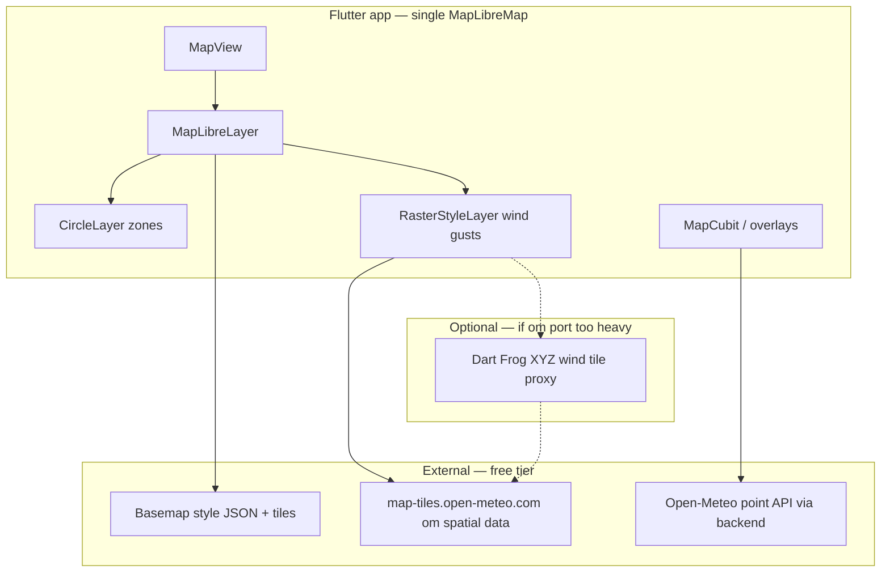
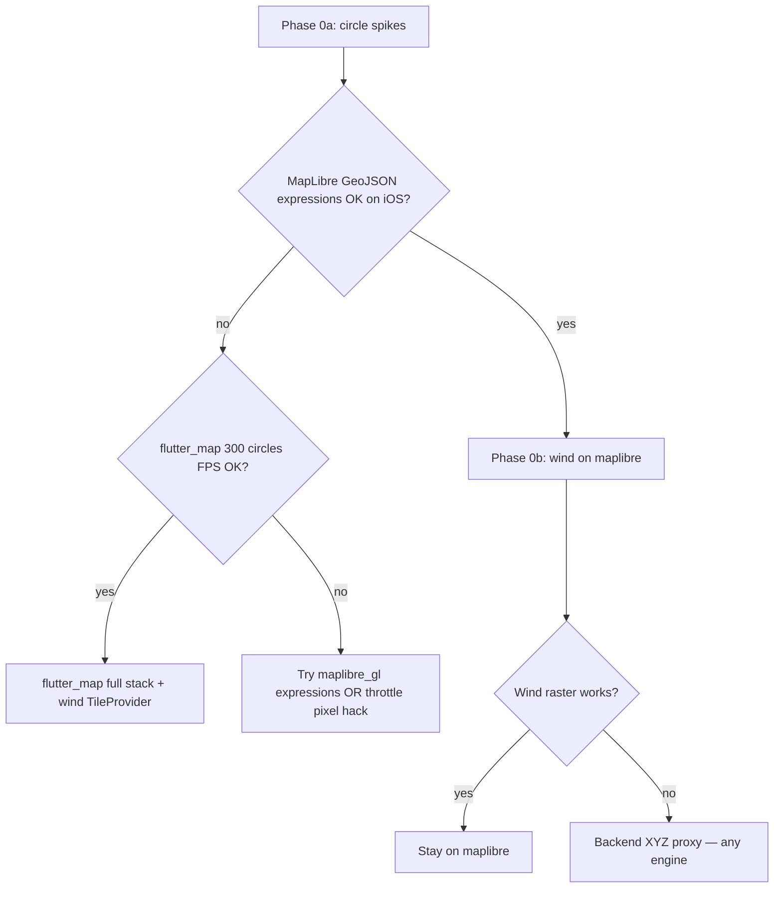

## feat: native map reimplementation with Flutter wind layer — Extensive

> **Decision (2026-06-03):** **flutter_map** chosen for basemap + zone circles. Phase 1 landed in app code (`FlutterMapLayer`, `useRadiusInMeter`). Wind WebView overlay retained until native wind `TileProvider` spike.
>
> **Supersedes (partially):** [2026-06-04-feat-maplibre-open-meteo-wind-map-plan.md](./2026-06-04-feat-maplibre-open-meteo-wind-map-plan.md) — MapLibre native base map removed from app; wind WebView still temporary.

## Overview

Reimplement the flight map as **one native MapLibre map** where:

1. **Wind gusts** render as a **native raster layer** (no `WindMapWebView`, no bundled MapLibre GL JS, no camera coordinator / gesture proxy).
2. **Zone circles** represent **true meter radius on the ground** and scale smoothly while pinch-zooming (fix current implementation gaps — see [Zone circles: what’s broken](#zone-circles-whats-broken)).
3. **Basemap tiles** use a **free, production-viable** provider (with documented fallbacks).

Point weather (tap advisory), search, and zone sync remain unchanged (backend + cubits).

## Problem statement / motivation

| Pain today | Why it matters |
|------------|----------------|
| **Dual map engines** — native MapLibre + WebView MapLibre GL JS | Two GL contexts, ~2× memory, fragile camera sync (`MapWindCameraCoordinator`, `WindMapGestureProxy`) |
| **Wind only via `om://`** in JS | [MapLibre Native custom protocols](https://github.com/maplibre/maplibre-native/issues/3562) are not exposed in the Flutter `maplibre` package API used here |
| **GPL-2.0 vendored JS** (`weather-map-layer.js`) | Distribution and compliance overhead in `assets/wind_map/` |
| **Product gap** | Pilots want **zones + wind together** on one map; overlay mode is a workaround, not a unified experience |
| **CARTO default** | Works without a key today, but **tile ToS must be validated** for your distribution model (see provider matrix) |

## Research decision

External research was required for **Open-Meteo tile format** and **free basemap ToS**. Findings are incorporated below. Local codebase already has strong patterns (`MapZoneMapLibreLayers`, `MapConfig`, `WindMapOmUrlResolver`).

## Proposed solution

### Target architecture

### Wind data: ranked approaches

Open-Meteo field tiles are **not** standard `{z}/{x}/{y}.png` URLs. The [`@openmeteo/weather-map-layer`](https://github.com/open-meteo/weather-map-layer) package registers a custom **`om://`** handler that reads spatial metadata (`latest.json`) and renders **32×32** chunks from **`.om`** spatial files on `map-tiles.open-meteo.com` (CC BY 4.0 data; layer package **GPL-2.0**).

| Rank | Approach | Fits “wind on Flutter” | Effort | Notes |
|------|----------|------------------------|--------|-------|
| **1 (recommended spike)** | **Dart `OmTileRenderer`** — port decode + colorscale from `weather-map-layer` (or call WASM via `dart:ffi` / isolate) → register tiles as **`RasterSource`** via `StyleController` | Yes — pure Dart/Native | High | Removes WebView **and** GPL JS bundle if logic is reimplemented from spec; keep `WindColorscale` in sync |
| **2 (fallback)** | **Backend XYZ PNG proxy** on Dart Frog — server runs JS or pre-rendered tiles, client uses `RasterSource` URL template | Yes — native consumer | Medium–High | Ops + cache headers; shifts GPL/compute off device; good if Dart port slips |
| **3 (defer)** | Wait for **MapLibre Native `addProtocol`** in `maplibre` Flutter bindings | Partial — still not “Flutter painter” | Unknown | Track [maplibre-native#3562](https://github.com/maplibre/maplibre-native/issues/3562) / Flutter package changelog |
| **4 (reject)** | **`CustomPainter` + grid API** only | Technically Flutter | Medium | No tile pyramid; poor pan/zoom perf; not suitable for continuous field |
| **5 (reject)** | Keep WebView overlay | No | — | Explicitly out of scope for this plan |

**Spike gate (Phase 0):** Prove one visible tile at Argentina zoom decodes and displays via `mapController.style.addSource(RasterSource(...))` + `RasterStyleLayer` before deleting WebView code.

**Open-Meteo limits (public endpoint):** ~600 req/min, 5k/hour, 10k/day — design disk/memory cache per tile and debounce style reloads. Confirm [licence](https://open-meteo.com/en/licence) if the app is commercial.

### Zone circles: what’s broken

The current `MapZoneMapLibreLayers` path does **not** keep geographic size during zoom:

| Issue | Code / behavior | User-visible effect |
|-------|-----------------|---------------------|
| **Stale radius while gesturing** | `_zoom` / bounds update only on `MapEventCameraIdle`, not `MapEventMoveCamera` (`map_libre_layer.dart`) | Circles “stick” during pinch, then jump when you release |
| **Pixel radius, not map-native** | `CircleLayer.radius` is an `int` in pixels; recomputed in Dart (`map_zone_maplibre_layers.dart`) | Depends on Flutter rebuild cadence, not GL interpolation |
| **512px clamp** | `.clamp(1.0, 512.0)` | Large zones (e.g. 5 km) shrink incorrectly when zoomed in |
| **300 `CircleLayer`s** | One declarative layer per zone | Heavy rebuilds; comment cites “iOS-safe; no zoom expressions” — avoids the **correct** MapLibre fix |

`MapZoneOverlayBuilder` / `MapZoneDisplay` (filtering, colors, meter data) are fine — reuse them on any engine.

### Zone circles: target behavior

- A zone with `radiusMeters: 5000` covers the same ground area at every zoom (Mercator-consistent per latitude).
- Radius updates **continuously** during zoom gestures.
- Keep culling (`maxCircles`, bounds, zoom thresholds).

### Zone circles: implementation options (pick one in Phase 0 spike)

| Path | Engine | How | Wind on same map |
|------|--------|-----|------------------|
| **A (preferred if spike passes)** | Stay on `maplibre` | Single `GeoJsonSource` + one `CircleStyleLayer` with `circle-radius` **zoom expression** per feature (`radius_meters` + `lat` property; exponential `base: 2` stops — see [Mapbox/MapLibre meter circle pattern](https://stackoverflow.com/questions/37599561)) | `RasterSource` under circles |
| **B** | Stay on `maplibre` | Update pixel radius on **throttled** `MapEventMoveCamera` (e.g. 60ms); remove 512 clamp or scale with zoom | Same |
| **C** | **`flutter_map`** | `CircleLayer` + `CircleMarker(useRadiusInMeter: true)` — radius from camera every paint | `TileLayer` + custom `TileProvider` for wind |
| **D** | `maplibre_gl` | Same as A via imperative style API | Same raster path |

**Do not** treat Path B as the long-term fix — it fights the engine. Path A is the native MapLibre solution; Path C is the native Flutter solution.

**Layer order (all paths):** basemap → wind raster (opacity ~0.85) → zone circles → selection → attribution.

### Basemap providers — free / production analysis

| Provider | Cost | Production use | Flutter (`maplibre` 0.3.x) | Light + dark | Offline | Recommendation |
|----------|------|----------------|----------------------------|--------------|---------|----------------|
| **CARTO CDN** (`basemaps.cartocdn.com`) | No API key; [license](https://carto.com/legal/bmaps) requires attribution; commercial terms vary | OK for many OSS apps with attribution; **verify** if you monetize or high traffic | ✅ Style JSON today (`MapConfig`) | ✅ Voyager + Dark Matter | Cache via MapLibre offline regions (future) | **Keep as default** until ToS review says otherwise |
| **OpenFreeMap** | Free hosted tiles, no key | Explicitly aimed at production OSS | ✅ Vector styles | ✅ bright/dark variants | Self-host planet PMTiles optional | **Primary migration candidate** if CARTO terms are a concern |
| **MapTiler** | Free tier ~100k tile requests/month | Allowed for dev / limited prod; pauses at quota | ✅ | ✅ | Paid / self-host later | **Fallback** via existing `--dart-define=MAP_STYLE_URL_*` |
| **Protomaps PMTiles** | Free planet download; hosting ~$5–10/mo (R2) | ✅ Self-hosted | ✅ `pmtiles://` in style | Custom / basemap presets | Best offline story | **Long-term** for home-server alignment |
| **OSM `tile.openstreetmap.org`** | Free | **Not for app production** per [tile usage policy](https://operations.osmfoundation.org/policies/tiles/) | ✅ | Manual | — | **Do not use** |
| **Stadia / Thunderforest** | Hobby free tiers | Non-commercial / low volume | ✅ | ✅ | Limited | Optional dev-only |
| **Google Maps** | Paid | Removed from app | — | — | — | **Out of scope** (already migrated) |

**Recommendation for this OSS app:**

1. **Short term:** Keep CARTO defaults in `MapConfig` (already documented in README).
2. **Parallel:** Add **OpenFreeMap** style URLs behind `--dart-define` (or flavor) and run a **ToS + attribution** checklist before release.
3. **Scale / offline:** Plan Protomaps Argentina extract on backend object storage when traffic grows.

Wind tiles (Open-Meteo) remain **independent** of basemap provider.

## Implementation phases

### Phase 0 — Spikes (parallel, timeboxed ~3 days each)

**Goal:** Choose map engine + circle strategy before deleting WebView.

#### Spike 0a — Circle scaling (required)

- [ ] **MapLibre expression path:** GeoJSON features with `radius_meters`, `lat`; one `CircleStyleLayer` with interpolated `circle-radius`; test on **iOS + Android** during live pinch-zoom
- [ ] **flutter_map path:** `FlutterMap` + 300 `CircleMarker(useRadiusInMeter: true)` over Argentina bbox; measure jank (DevTools timeline) while panning/zooming
- [ ] **Exit criteria:** Geographic radius stable during gesture; document FPS and which path passes

#### Spike 0b — Native wind tile (required)

- [ ] Create `lib/map/wind/` module:
  - `wind_om_tile_decoder.dart` — fetch `latest.json` (reuse `WindMapOmUrlResolver`), fetch/decode om chunks for `{z,x,y}`
  - `wind_tile_cache.dart` — LRU keyed by `z/x/y` + model/time_step
  - `wind_raster_layer.dart` — on `MapEventStyleLoaded`, `style.addSource` + `style.addLayer` (`RasterStyleLayer`, opacity 0.85)
- [ ] Spike test: golden or integration test with mocked HTTP returning fixture om bytes
- [ ] Document colorscale parity with `WindColorscale` / prior JS output (screenshot diff optional)
- [ ] **Gate:** If 0b fails in 3–5 days → backend XYZ proxy before further UI work

#### Spike decision matrix (after 0a + 0b)

| 0a result | 0b on `maplibre` | Recommendation |
|-----------|------------------|----------------|
| Expressions OK, FPS good | OK | **Stay on `maplibre`** — GeoJSON circles + raster wind |
| Expressions fail iOS | OK | **`maplibre_gl`** or **flutter_map** (re-test 0a on `maplibre_gl`) |
| Expressions OK | Fail | **flutter_map** if 0a flutter_map FPS good; else fix raster on `maplibre` |
| Both MapLibre paths fail circles | flutter_map FPS OK | **`flutter_map`** full stack (circles + wind `TileProvider`) |
| Both fail | — | Revisit requirements (fewer circles, polygon simplify, backend-rendered zones) |

**Phase 0b — Backend proxy (fallback spike)**

- [ ] `GET /v1/map/wind/{model}/{z}/{x}/{y}.png` on Dart Frog
- [ ] Server-side render using pinned `weather-map-layer` (GPL compliance documented) + disk cache
- [ ] Client `RasterSource` URL template pointing at backend only (no `map-tiles` from client)

### Phase 1 — Integrate wind toggle on unified map (PR 2)

- [ ] `MapLibreLayer`: optional wind layer; toggle from FAB sets state / calls `WindRasterController`
- [ ] Remove from `MapView`: `WindMapWebView`, `WindMapGestureProxy`, `MapWindCameraCoordinator`, `_windMapController`
- [ ] Delete `assets/wind_map/*`, `WindMapHtmlLoader`, `scripts/vendor_wind_map_assets.sh` (after parity QA)
- [ ] Update `map_initializer.dart` — drop WebView prewarm if present
- [ ] Wind + zones + tap + search work **simultaneously** (resolves old plan “exclusive wind mode” AC)
- [ ] Error UX: reuse `WindMapUserMessage` codes → native load failures (timeout, 503, decode error)

### Phase 2 — Provider hardening (PR 3)

- [ ] Document provider choice in README (CARTO vs OpenFreeMap vs MapTiler dart-define)
- [ ] Add OpenFreeMap style URLs as opt-in default for CI / staging
- [ ] Attribution widget covers basemap + Open-Meteo wind (CC BY 4.0)
- [ ] Rate-limit friendly caching for wind tiles

### Phase 3 — Quality, accessibility, cleanup (PR 4)

- [ ] Performance: 300 zone circles + wind pan at 60fps on mid-tier device (profile DevTools)
- [ ] Semantics: wind FAB label, wind-unavailable banner
- [ ] Remove GPL wind assets from repo; record license decision in README
- [ ] Update `integration_test/wind_map_screenshot_test.dart` for native layer
- [ ] Delete obsolete tests: `wind_map_bridge_test` WebView JS channel paths

## Technical considerations

### `maplibre` package capabilities

- Declarative `CircleLayer` for zones (current).
- **`RasterSource` / `RasterStyleLayer`** via `MapController.style` (`StyleController`) after style load — use for wind (not in declarative `layers:` list today).
- Programmatic layer ordering: add wind before re-adding circle layers, or use `beforeId` if supported in platform interface.

### Licensing

| Component | License | Action |
|-----------|---------|--------|
| Open-Meteo data | CC BY 4.0 | Keep attribution in UI |
| `weather-map-layer` (if kept server-side) | GPL-2.0 | Prefer **Dart reimplementation** or **backend-only** with compliance doc |
| MapLibre | BSD | OK |
| Basemap | Provider-specific | Attribution via `SourceAttribution` |

### Performance

- Decode om tiles in **isolates** to avoid jank.
- Cap concurrent tile fetches (e.g. 6–8).
- Reuse `MapZoneDisplay` culling — wind does not change zone count logic.

### Security

- Wind tiles are public HTTPS; no secrets on client.
- Backend proxy (if used) should cache anonymously, no user PII in tile URLs.

## Acceptance criteria

### Unified map

- [ ] Single `MapLibreMap` renders basemap, wind (when on), and zone circles together
- [ ] No `webview_flutter` usage under `lib/map/`
- [ ] Zone circles keep constant ground radius while pinch-zooming (no idle-only jump; no incorrect 512px cap for large zones)
- [ ] Wind toggle adds/removes raster layer within 3s on good network
- [ ] Tap-to-check, search, zone detail overlay work with wind enabled

### Wind rendering

- [ ] Gust field uses `WindMapConfig` model/variable/timeStep (or successor config class)
- [ ] Colors match `WindColorscale` within acceptable tolerance
- [ ] Tile failures show localized message (not blank map)
- [ ] Works on iOS 15+ and Android (same MapLibre constraints as today)

### Providers

- [ ] Default build runs **without** Google Maps or MapTiler keys
- [ ] README documents ≥2 free basemap options and attribution requirements
- [ ] Production does **not** use `tile.openstreetmap.org` directly

### Tests

- [ ] Unit tests for om URL resolver (existing) + tile decoder (new fixtures)
- [ ] Widget/smoke test: wind toggle changes layer count or style source list
- [ ] Zone overlay builder tests remain green

## Success metrics

| Metric | Target |
|--------|--------|
| Wind toggle latency | < 3s first paint (warm cache < 1s) |
| Pan/zoom with wind + 300 zones | No visible WebView-style desync (N/A — single map) |
| APK/asset size | Drop vendored `maplibre-gl.js` + `weather-map-layer.js` (hundreds of KB+) |
| Crash rate on map tab | No increase vs WebView baseline |

## Dependencies and risks

| Risk | Mitigation |
|------|------------|
| om format decode harder than expected | Phase 0b backend proxy; timebox spike |
| `RasterSource` API gaps on web target | Confirm `maplibre_web` raster support; defer web wind or use JS only on web |
| Open-Meteo rate limits | Aggressive tile cache; optional self-host snapshot later |
| GPL if copying JS verbatim into Dart | Reimplement from format docs / tests against fixtures |
| CARTO ToS for commercial app | OpenFreeMap fallback documented |

## User flows (from flow analysis)

| Flow | Expected behavior after reimplementation |
|------|------------------------------------------|
| Browse map | Native basemap + zones; smooth pan/zoom |
| Toggle wind | FAB adds native raster; no camera jump |
| Tap point / zone | Works with wind on; assessment overlay unchanged |
| Search / locate | Camera moves; wind tiles refetch for new bounds |
| Theme switch | `setStyle` preserves camera; wind + zones redraw |
| Poor network | Wind off or error banner; basemap + zones still usable |
| Offline | Wind hidden or cached tiles only; no mock wind on map |

## Map library decision (should we switch?)

**Short answer:** Switching is **reasonable** if circle spikes show MapLibre expressions fail on iOS or `flutter_map` hits performance targets. **Neither choice fixes wind alone** — you still need om decode or a XYZ proxy. **Circle scaling and wind are two spikes, one decision.**

### Comparison (corrected for circle behavior)

| Library | Meter circles during zoom | Wind raster | Migration cost | When to pick |
|---------|---------------------------|-------------|----------------|--------------|
| **`maplibre` (current)** | **Broken today**; fix via GeoJSON + `circle-radius` expressions (Path A) | `RasterSource` via `StyleController` | **Low** if 0a passes | Default if expressions work on iOS |
| **`maplibre_gl`** | Same expression approach; more battle-tested style API | Same raster path | **Medium–high** | `maplibre` package limits (style API, iOS bugs) |
| **`flutter_map`** | **`useRadiusInMeter: true`** — correct by design, every frame | `TileLayer` + `TileProvider` (natural for om decode) | **High** (new map widget, camera, tap, tests) | MapLibre circle expression fails **and** 300-circle FPS acceptable |
| **`flutter_map_maplibre`** | Hybrid | Same om issue | Experimental | Defer |

### Smart decision rule

1. **Run Spike 0a first** — circles are the regression you feel daily; wind is a separate overlay problem.
2. If **MapLibre expressions work** → stay on `maplibre` (smallest diff: fix zones + add wind raster; delete WebView).
3. If **expressions fail** (the old “iOS-safe” fear was real) → **`flutter_map` is the principled switch** for meter circles + wind tiles in one Dart stack, **if** FPS passes.
4. **`maplibre_gl`** is the middle ground when you want GL performance but josxha’s declarative layer API blocks style expressions.

Do **not** choose `flutter_map` only for wind while keeping MapLibre for base — that recreates dual-camera sync.

## Alternative approaches considered

| Approach | Why not chosen |
|----------|----------------|
| **Full `flutter_map` rewrite** | High migration cost; 300-circle perf risk; does not avoid om decode |
| **`maplibre_gl` fork** | Heavier; only if `maplibre` spike fails gates |
| **Keep WebView overlay** | User explicitly requested Flutter/native wind |
| **Exclusive wind mode (old plan)** | Rejected — unified map enables zones + wind |
| **`flutter_map_maplibre` hybrid** | Too immature (0.0.5); same om constraint |

## References and research

### Codebase

- `lib/map/view/map_view.dart` — WebView stack to remove
- `lib/map/view/widgets/map_libre_layer.dart` — extension point for wind raster
- `lib/map/map_zone_maplibre_layers.dart` — native zoom-scaled circles
- `lib/map/map_config.dart` — basemap URLs
- `lib/map/wind_map_om_url_resolver.dart` — metadata URL
- `lib/map/wind_colorscale.dart` — legend parity
- `assets/wind_map/wind_map.js` — current om:// integration (reference for port)

### Prior plans

- [2026-06-04-feat-maplibre-open-meteo-wind-map-plan.md](./2026-06-04-feat-maplibre-open-meteo-wind-map-plan.md)
- [2026-06-03-refactor-replace-paid-apis-open-alternatives-plan.md](./2026-06-03-refactor-replace-paid-apis-open-alternatives-plan.md)

### External

- [open-meteo/weather-map-layer](https://github.com/open-meteo/weather-map-layer)
- [open-meteo/om-file-format](https://github.com/open-meteo/om-file-format)
- [Open-Meteo licence](https://open-meteo.com/en/licence)
- [maplibre-native custom protocol issue](https://github.com/maplibre/maplibre-native/issues/3562)
- [OSM tile usage policy](https://operations.osmfoundation.org/policies/tiles/)
- [OpenFreeMap](https://openfreemap.org/)
- [CARTO basemap license](https://carto.com/legal/bmaps)
- [Protomaps](https://protomaps.com/)

## Recommended PR split

| PR | Scope | Merge gate |
|----|-------|------------|
| **PR A** | Phase 0 spike — native wind tile visible | Demo screenshot + decoder unit tests |
| **PR B** | Phase 1 — toggle, remove WebView, zones+wind | Manual QA Argentina; integration test updated |
| **PR C** | Phase 2 — provider docs + OpenFreeMap opt-in | README + attribution |
| **PR D** | Phase 3 — a11y, perf, license cleanup | Review checklist complete |

Do **not** merge PR B until PR A gate passes.
