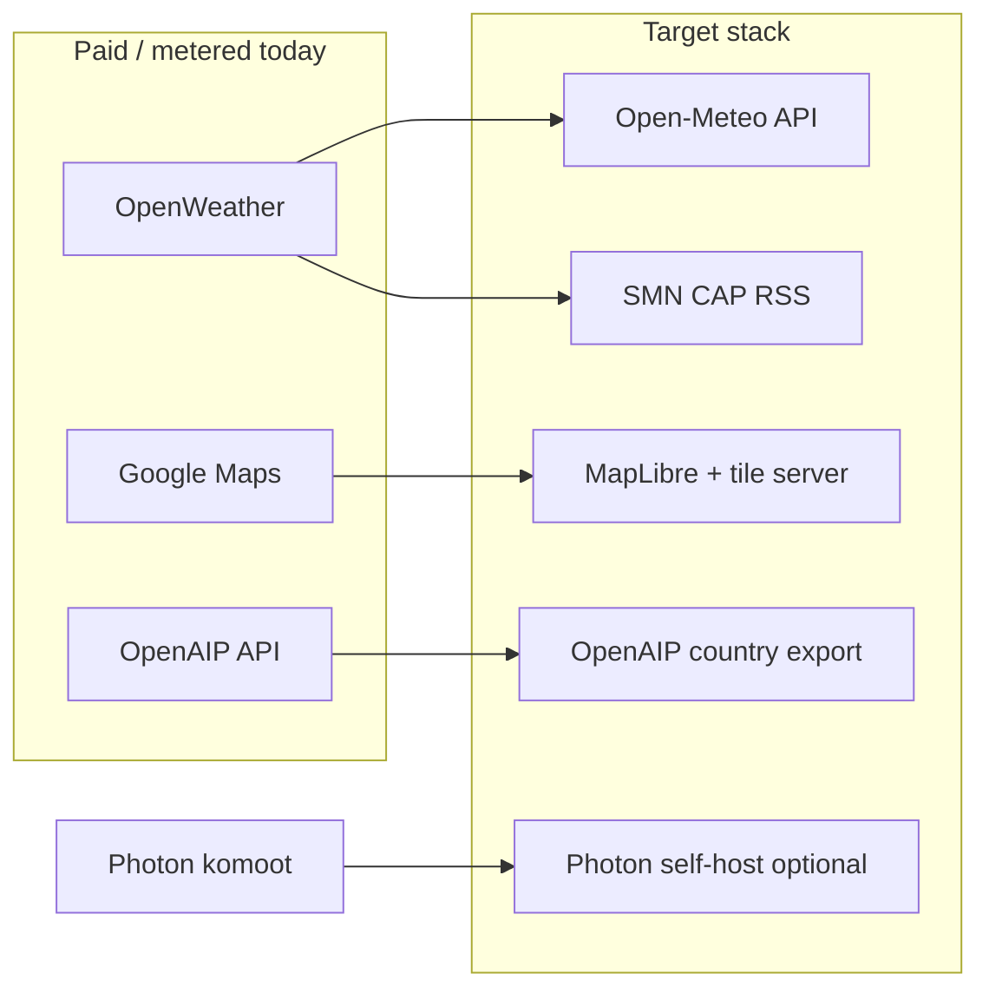

## Replace paid third-party services with open alternatives — Extensive

## Overview

Dónde Volar already runs most **backend** infrastructure as self-hosted open source (PostgreSQL, Redis, MinIO, Dart Frog). The remaining cost and vendor risk sits in **external APIs** (OpenWeather, Google Maps, optional OpenAIP) and **optional** services (Google/Apple OAuth, FCM). This plan replaces paid or metered dependencies with **free/open data sources and OSS libraries**, documents **trade-offs** (especially safety and licensing), and ships in **phases** so map verdicts never regress.

**Research decision:** External research was required (weather licensing, map tile policy, OpenAIP bulk exports, push alternatives). Findings from official docs and project agents are incorporated below.

## Problem Statement

| Dependency | Where used | Cost / risk today |
|------------|------------|-------------------|
| **OpenWeather One Call 3.0** | `backend/lib/services/weather_service.dart` | Pay-as-you-go after ~1k calls/day; empty key → **mock calm weather** (safety risk) |
| **Google Maps SDK** | `lib/map/view/widgets/map_google_layer.dart`, `pubspec.yaml` | Billing account + Maps SDK; tiles need network; no offline tiles |
| **OpenAIP API** | `backend/lib/services/zone_ingest_service.dart` | Free tier + API key; CC BY-NC data; polygon→circle approximation |
| **Photon (komoot)** | `backend/lib/services/geocoding_service.dart` | Already free public API; fair-use, no SLA |
| **Google / Apple OAuth** | `backend/lib/config/app_config.dart` | OAuth free; Apple Developer ~$99/yr if shipped |
| **FCM** | `backend/lib/services/notification_service.dart` (stub) | Free messaging; Google account + APNs for iOS |
| **MinIO / Postgres / Redis** | `backend/docker-compose.yaml` | Already OSS — **no change** |

**Motivation:** Align with a **free-first** ops model (home server), remove billing surprises, keep **upstream keys off the client**, and avoid silently misleading pilots (mock weather, stale zones).

## Proposed Solution

Adopt a **tiered replacement strategy**:

1. **Replace immediately (low effort, high value):** OpenWeather → **Open-Meteo** + existing **SMN CAP RSS**; remove production mock weather; drop `OPENWEATHER_API_KEY` from required config.
2. **Replace with backend-only pattern (medium effort):** OpenAIP live API → **scheduled bulk export ingest** (same GeoJSON pipeline); keep bundled + MADHEL as safety baseline.
3. **Replace with largest UX/engineering cost:** Google Maps → **MapLibre** (recommended) or `flutter_map` + **self-hosted or paid OSM-compatible tiles** — not public `tile.openstreetmap.org` in production.
4. **Harden existing free paths:** Photon stays proxied; optional **self-hosted Photon** in compose for scale.
5. **Explicitly defer or keep:** FCM (free, best Flutter+iOS story); email/password auth (already works); MinIO (already OSS).

## Technical Approach

### Architecture

- **No change** to VGV layered app structure (`packages/*` data/repository, `lib/` presentation).
- **Backend remains the API-key gate:** weather and geocoding stay proxied; zone ingest stays server-side cron.
- **Client map layer** becomes a swappable widget (`MapGoogleLayer` → `MapOsmLayer` / MapLibre) behind the same `MapGoogleLayerController`-style imperative API for camera + overlay builder reuse.

### Replacement matrix (with trade-offs)

| Service | Recommended alternative | License / cost | Pros | Cons |
|---------|-------------------------|----------------|------|------|
| **OpenWeather** | [Open-Meteo](https://open-meteo.com/en/docs) + SMN CAP (already in `weather_service.dart`) | API: **non-commercial free**; data CC BY 4.0; commercial from ~$29/mo | No key on public endpoint; wind in m/s; global grid; fits advisory thresholds | NC license if app monetizes; no official Argentina-only model; multi-altitude wind is weaker than aviation products |
| **Google Maps** | [MapLibre Flutter](https://github.com/maplibre/flutter-maplibre-gl) + vector/raster tiles (Protomaps, MapTiler free tier, or self-hosted) | MapLibre BSD; **tile provider terms vary** | Native circle layers; dark styles; better perf with 300+ zones than pure Dart | Large migration; must host tiles; offline = extra work (mbtiles/FMTC); README “offline tiles” claim needs rewrite |
| **OpenAIP API** | [Country exports](https://www.openaip.net/data/exports) ingested in `ZoneIngestService` | **CC BY-NC 4.0** | No per-request key on client; cron-friendly; matches existing merge pipeline | Data community-maintained; still **circle approximation**; NC if selling airspace data alone |
| **Photon (komoot)** | Keep proxy; add **self-hosted Photon** in compose when traffic grows | Photon OSS; OSM data ODbL | Already Argentina-biased; fast search | Self-host RAM/ops; reverse geocode sends coords to your server |
| **Google/Apple OAuth** | **Email/password only** (current UI) or add later | — | Zero vendor; simplest privacy story | No one-tap social login |
| **FCM** | Keep when implementing push | FCM $0 for messages | Reliable iOS+Android; mature Flutter plugins | Google dependency; APNs cert work |
| **MinIO** | Keep | AGPL / OSS | S3-compatible; already in compose | Ops disk for media (not a SaaS fee) |

### Services that are already “free enough” (no replacement)

- **ANAC MADHEL** — government API, used in `MadhelZonesApiClient` / zone ingest.
- **Bundled zones** — offline snapshot in `BundledZonesApiClient`.
- **JWT auth** — self-hosted.
- **Postgres / Redis / Caddy** — self-hosted.

### Implementation Phases

#### Phase 1: Weather — Open-Meteo default (Foundation)

**Goal:** Real weather with **zero OpenWeather dependency**; SMN alerts retained.

**Tasks:**

- [ ] Add `OpenMeteoWeatherClient` (or inline) in `backend/lib/services/weather_service.dart`:
  - `GET https://api.open-meteo.com/v1/forecast` with `wind_speed_unit=ms`, `current=wind_speed_10m,wind_gusts_10m,…`, `hourly=…`, `timezone=auto`
  - Map response → existing `WeatherSnapshot` shape (`current.wind_speed`, `wind_gust`, `wind_deg`, etc.) so `packages/weather_api_client` unchanged
- [ ] Keep `_fetchSmnAlerts()`; merge before advisory scoring
- [ ] Selection order: `OPENWEATHER_API_KEY` set → legacy OWM path (optional); else Open-Meteo; **never** `_mockWeather()` unless `WEATHER_MOCK=true` in dev
- [ ] Boot validation: fail fast in production if no real upstream (config flag `WEATHER_PROVIDER=open-meteo|openweather`)
- [ ] Extend `backend/test/services/weather_service_test.dart` with fixture JSON for Open-Meteo
- [ ] Update `backend/.env.example`, `backend/README.md`, remove OpenWeather from “required production” list
- [ ] Document commercial Open-Meteo pricing if app monetizes

**Success criteria:**

- [ ] Golden coords (Buenos Aires, Córdoba, Ushuaia): wind/gust/advisory bands within ±0.5 m/s of current thresholds
- [ ] Empty `OPENWEATHER_API_KEY` returns **live** data, not mock
- [ ] 15-minute in-memory cache preserved

**Estimated effort:** 1–2 days

#### Phase 2: Zones — OpenAIP bulk ingest (Core data)

**Goal:** Drop live OpenAIP API key dependency; improve cron reliability.

**Tasks:**

- [ ] Add `OpenAipExportZonesClient` reading Argentina ND-GeoJSON / export URL (documented in OpenAIP exports page)
- [ ] Wire into `ZoneIngestService` instead of `OpenAipZonesApiClient` when `OPENAIP_API_KEY` empty
- [ ] Align merge with `ZoneDeduplicator` priorities (`openaip_` > `prohibited_`/`park_` > `madhel_`) — update ingest to **prefer higher-priority source on id collision**, not last-writer-wins
- [ ] Cron: `POST /v1/cron/zone_ingest` — if MADHEL returns 0, **retain previous MADHEL features** in feed (define policy in code + test)
- [ ] Pass `OPENAIP_API_KEY` / export path in `docker-compose.yaml` if still needed for export auth
- [ ] Health/`GET /health`: expose `zoneFeedAgeHours` for ops

**Success criteria:**

- [ ] Ingest with no API keys still publishes feed with bundled + MADHEL + export OpenAIP
- [ ] Golden `assess()` suite (≥20 points) unchanged vs pre-migration baseline
- [ ] No regression: national parks / Casa Rosada still present when OpenAIP enabled

**Estimated effort:** 2–3 days

#### Phase 3: Map — Google Maps → MapLibre + tiles (Largest)

**Goal:** Remove `google_maps_flutter` and `MAPS_API_KEY` requirement.

**Tasks:**

- [ ] Spike: MapLibre with Argentina center, dark style, 300 `Circle` layers
- [ ] Choose tile provider (document in README): e.g. Protomaps PMTiles self-hosted, MapTiler free dev key, or own raster server — **not** production traffic to `tile.openstreetmap.org`
- [ ] Replace `MapGoogleLayer` with `MapLibreLayer` (or rename to `MapBaseLayer`) keeping `MapZoneOverlayBuilder` / `MapZoneDisplay` culling logic
- [ ] Port `MapInitializer` / `map_prewarm.dart` / theme handling
- [ ] Remove `google_maps_flutter*` from `pubspec.yaml`; delete Android/iOS Maps key plumbing (`MAPS_API_KEY`, `GOOGLE_MAPS_API_KEY`)
- [ ] Update tests: `map_search_listeners_test.dart`, overlay builder tests (latlong vs gmaps types)
- [ ] Optional Phase 3b: regional tile cache (mbtiles) for partial offline

**Success criteria:**

- [ ] App runs with **no Google Maps API keys**
- [ ] Attribution visible per tile license
- [ ] Theme toggle preserves camera (no remount regression)
- [ ] Zone circles + highlight behavior parity with `map_google_layer.dart`
- [ ] Tile failure shows retry UI, not blank map

**Estimated effort:** 1–2 weeks

#### Phase 4: Geocoding hardening (Polish)

**Tasks:**

- [ ] Add request timeout + structured errors (already partially in `geocoding_service.dart`)
- [ ] Optional: Photon service in `docker-compose.yaml` for self-host
- [ ] Fix docs drift: README still says Nominatim; implementation is Photon (`geocoding_api_client`)

**Estimated effort:** 1–2 days

#### Phase 5: Config & ops cleanup (Polish)

- [ ] Remove secrets from committed `.env` (rotate any exposed keys)
- [ ] `.env.example` documents free-first defaults (empty paid keys)
- [ ] Ops runbook: cron schedule, Open-Meteo usage monitoring, tile server disk

### Out of scope (this plan)

- **Polygon airspace geometry** (true point-in-polygon) — separate safety initiative; circles remain unless explicitly funded
- **FCM → UnifiedPush** — high cost, weak iOS story; FCM stays recommended when push ships
- **Full offline map** for Argentina — optional follow-up after tile cache
- **Terrain elevation for MSL vs AGL** — noted in `docs/code-review/vgv-review.md`

## Alternative Approaches Considered

| Approach | Why not default |
|----------|-----------------|
| **Keep OpenWeather free tier** | Still metered; mock fallback dangerous; doesn’t meet “full replacement” |
| **`flutter_map` only** | Simpler but worse performance with hundreds of circles; raster dark mode harder |
| **Client-side Open-Meteo** | Exposes usage pattern; bypasses cache; violates “keys on server” |
| **Drop OpenAIP entirely** | Loses controlled airspace layer; safety gap near aerodromes |
| **Nominatim instead of Photon** | Heavier self-host; slower autocomplete; worse UX for search-as-you-type |
| **Public OSM tiles in prod** | Violates [OSM tile policy](https://operations.osmfoundation.org/policies/tiles/); will get blocked |

## Acceptance Criteria

### Functional

- [ ] **Weather:** `GET /v1/weather` uses Open-Meteo when `OPENWEATHER_API_KEY` unset; SMN alerts included; production never returns mock without `WEATHER_MOCK=true`
- [ ] **Weather UI:** Authed user sees real wind; guest sees `requiresAuth`; 502 shows error card
- [ ] **Zones:** Ingest without paid keys produces full merged feed; cron partial failure does not wipe MADHEL
- [ ] **Map:** Builds and runs without Google API keys on iOS 15+ and Android
- [ ] **Geocoding:** Search/reverse unchanged for Argentina bbox; backend proxy only
- [ ] **Auth:** Email/password signup/login unchanged
- [ ] **Guest map:** Tap-to-check works without account (non-negotiable)

### Non-functional

- [ ] Weather p95 &lt; 500 ms on cache hit (unchanged target from social-weather plan)
- [ ] Map pan/zoom with 759 zones: no severe jank on mid-range device
- [ ] Zero upstream API keys in Flutter release binary (`--dart-define` OpenAIP removed from client if any remain)

### Quality gates

- [ ] `backend/test/services/weather_service_test.dart` covers Open-Meteo mapping + SMN merge
- [ ] New golden-point tests for `FlightRulesRepository.assess()` before Phase 2 merge changes
- [ ] `flutter test` + `dart analyze` clean
- [ ] README updated: Google Maps setup section replaced with tile provider setup

## Success Metrics

| Metric | Target |
|--------|--------|
| Monthly external API spend | **$0** at pilot scale (self-hosted tiles + Open-Meteo NC tier) |
| OpenWeather calls | **0** in production |
| Google Maps billing | **0** after Phase 3 |
| Weather mock in prod | **0** occurrences |
| Zone golden tests | **100%** pass pre/post Phase 2 |
| Zone feed staleness | &lt; 7 days with cron; banner when older |

## Dependencies & Prerequisites

- **Product decision:** Is the app **commercial**? If yes, budget Open-Meteo paid plan (~$29/mo) or self-host Open-Meteo (AGPL obligations).
- **Tile server** for Phase 3 must exist before cutting Google Maps.
- **Existing refactor:** `docs/plan/2026-06-03-refactor-map-page-layered-architecture-plan.md` — map layer extraction eases Phase 3; complete or branch from current `MapGoogleLayer` abstraction.

## Risk Analysis & Mitigation

| Risk | Severity | Mitigation |
|------|----------|------------|
| Mock weather shipped to prod | **Critical** | Boot check; remove `_mockWeather` default; tests |
| Zone merge drops parks when OpenAIP on | **Critical** | Align ingest with `ZoneDeduplicator`; golden tests |
| Circle vs polygon inaccuracy | **High** | Disclaimer for `openaip_` zones; long-term polygon plan |
| Open-Meteo NC license vs monetization | **High** | Legal/commercial plan; self-host or paid API |
| OSM tile blocking | **High** | Self-hosted/paid tiles only |
| Map migration regressions (camera, theme) | **Medium** | Manual QA checklist from map refactor plan |
| Photon rate limit | **Low** | Backend cache + debounce; self-host Phase 4 |
| MADHEL ingest empty | **Medium** | Retain last-good MADHEL in feed; alert on health endpoint |

## User flows (migration impact)

| Flow | Phase | User impact |
|------|-------|-------------|
| Tap map → verdict | — | Unchanged if zones stable |
| Tap → weather (authed) | 1 | Real wind instead of mock |
| Search address | 4 | Unchanged unless self-host misconfigured |
| Cold start offline | 2–3 | Zones OK; map tiles depend on Phase 3b cache |
| Login → zone sync | 2 | Fresher feed without OpenAIP API key |
| Theme dark/light | 3 | Must match readability of current `GoogleMapStyle` |

## Decisions required before build

1. **Commercial vs hobby** — drives Open-Meteo and OpenAIP NC compliance.
2. **Map engine:** MapLibre (recommended) vs `flutter_map`.
3. **Tile provider:** self-hosted PMTiles vs MapTiler vs other.
4. **OpenAIP:** bulk export only vs keep live API as fallback.
5. **Polygons:** defer (recommended) vs include in scope.

## References & Research

### Codebase

- Weather: `backend/lib/services/weather_service.dart`, `backend/routes/v1/weather/index.dart`
- Zones ingest: `backend/lib/services/zone_ingest_service.dart`, `packages/zones_api_client/lib/src/openaip_zones_api_client.dart`
- Zone dedupe: `packages/flight_rules_repository/lib/src/zone_deduplicator.dart`
- Map: `lib/map/view/widgets/map_google_layer.dart`, `lib/map/map_zone_overlay_builder.dart`
- Geocoding: `backend/lib/services/geocoding_service.dart`
- Prior plan: `docs/plan/2026-06-02-feat-backend-social-weather-plan.md` (Open-Meteo mentioned as mitigation)
- Safety reviews: `docs/code-review/architecture-review.md`, `docs/code-review/vgv-review.md`

### External

- [Open-Meteo API docs](https://open-meteo.com/en/docs) · [Terms](https://open-meteo.com/en/terms) · [Pricing](https://open-meteo.com/en/pricing)
- [SMN CAP feed](http://www.smn.gov.ar/feeds/CAP/avisocortoplazo/rss_acpCAP.xml)
- [OSM tile usage policy](https://operations.osmfoundation.org/policies/tiles/)
- [MapLibre Flutter](https://github.com/maplibre/flutter-maplibre-gl)
- [OpenAIP data exports](https://www.openaip.net/data/exports)
- [Photon geocoder](https://github.com/komoot/photon)
- [FCM pricing](https://firebase.google.com/pricing) (free tier for messages)

## AI-era implementation notes

- Implement **Phase 1 first** in isolation; verify weather card manually before map migration.
- Use **golden-point tests** as the safety gate before any ingest merge change.
- Do not widget-test platform map views; test overlay math and listeners (per map refactor plan).
- Human review required for: advisory threshold mapping, merge precedence, and licensing section in README.
