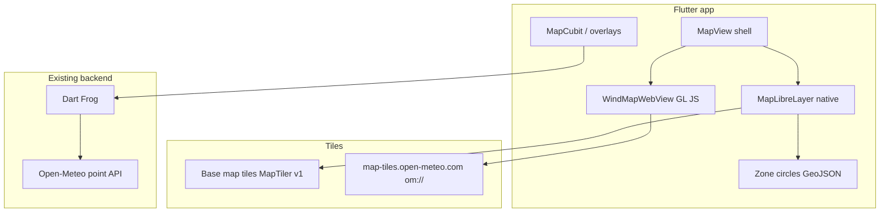

> **Status (2026-06-03):** Phase 1 shipped. Phase 2 **WebView + `om://` gust raster** restored (dot grid removed). Uses HTTPS `loadHtmlString` origin, bundled JS, CARTO basemap in WebView, Dart metadata prefetch. Point weather on tap unchanged.

## MapLibre base map + Open-Meteo wind layer — Extensive

> **Technical review (2026-06-04):** Refined after plan-technical-review. Recommended delivery: **4 PRs** aligned to phases below. Phase 3 polish deferred to backlog unless product requires it in v1.

## Overview

Replace **Google Maps** with **MapLibre** for the main flight map, and add a **wind field view** powered by **Open-Meteo** (`@openmeteo/weather-map-layer` + `om://` tiles). Point weather (tap advisory) stays on the existing Open-Meteo API via the backend.

**Critical platform constraint:** Open-Meteo’s weather map layer uses MapLibre GL **JS** `addProtocol('om', …)`. **MapLibre Native** (iOS/Android `maplibre` / `maplibre_gl`) does **not** support custom protocols yet ([maplibre-native#3562](https://github.com/maplibre/maplibre-native/issues/3562)). Therefore:

- **Main map (zones, tap, search):** MapLibre **native** in Flutter.
- **Wind map (raster):** MapLibre GL **JS** inside a **WebView** — **mutually exclusive mode** (swap widget, not stacked maps). No live bidirectional camera sync in v1.

This is still “full Open-Meteo” for wind visualization; it is not a single pure-native map widget today.

## Problem statement

- Pilots need **spatial** wind context, not only a single-point advisory.
- Google Maps adds billing and does not integrate Open-Meteo field data.
- Open-Meteo field tiles are **free** (CC BY 4.0) but require the **JS** map stack.

## Proposed solution

### Architecture

### Map stack choice

| Package | Use |
|---------|-----|
| [`maplibre`](https://pub.dev/packages/maplibre) (josxha) | **Preferred** — FFI on mobile, declarative API |
| `maplibre_gl` | **Only if spike fails** (see Phase 1 spike gates) |

### Base map tiles (v1: one provider)

**v1:** [MapTiler](https://www.maptiler.com/) free dev style URL via dart-define / flavor (never commit keys). Document Protomaps/self-host as future README footnote only.

### Open-Meteo wind data

| Layer | Source |
|-------|--------|
| Wind speed raster | `om://` via `@openmeteo/weather-map-layer` |
| Wind arrows | **Backlog** (v2) |
| Argentina clip | **Backlog** — v1 uses fixed Argentina center/zoom on wind mode enter |

**License:** `@openmeteo/weather-map-layer` is **GPL-2.0**. **Gate before Phase 2:** product/legal accepts WebView distribution (source offer, attribution, app license compatibility).

**Package status:** Pin npm version; feature flag to hide wind if tiles break; retry UI on failure (not blank screen).

### Product decision (document in AC)

**Wind mode is exclusive:** Base map **or** wind WebView — **no zone circles / tap assessment in wind mode** for v1. If pilots need zones + wind together, that requires a different approach (defer).

## Recommended PR split

| PR | Phase | Merge gate |
|----|-------|------------|
| **PR 1** | Phase 1 | App runs without Google API key; zone/tap/search parity |
| **PR 2** | Phase 2 (minimal) | Wind toggle + raster + attribution; point weather unchanged |
| **PR 3** | Phase 3 (backlog) | Camera inherit, time slider, clip, arrows — optional |
| **PR 4** | Phase 4 | README tiles, GPL documented, delete Google artifacts |

Do **not** merge PR 1 with PR 2 (different stacks, different failure modes).

## Implementation phases

### Phase 0 — Prerequisites (part of PR 1, first commits)

**Goal:** Platform-neutral map utilities before swapping the widget.

- [ ] Introduce `MapVisibleBounds` (or use `latlong2` bounds) in `lib/map/` — no `google_maps_flutter` in `map_zone_display.dart` / `map_zone_overlay_builder.dart`
- [ ] Rename `MapGoogleLayerController` → `MapCameraController` in `lib/map/` (moveTo, zoomBy, visibleBounds); platform layer implements it
- [ ] Update `map_search_listeners.dart`, `map_view.dart`, tests to use `MapCameraController`
- [ ] Port tests: `map_zone_display_test.dart`, `map_zone_overlay_builder_test.dart` use neutral bounds (or GeoJSON feature assertions)

### Phase 1 — MapLibre spike + base map (PR 1)

**Spike gates (pass before full implementation):**

- [ ] Meter-radius circles at ~−38° latitude
- [ ] `visibleBounds` for `MapZoneDisplay` culling
- [ ] Theme style swap **without** remount (no `ValueKey(brightness)` on map widget)
- [ ] Tap callbacks; safe dispose (mirror current `PlatformException` handling)
- [ ] If any gate fails: document fallback to `maplibre_gl` and stop josxha work

**Implementation:**

- [ ] Add `maplibre` dependency
- [ ] Create `lib/map/view/widgets/map_libre_layer.dart` implementing `MapCameraController`
- [ ] One tile style per brightness (MapTiler URL from dart-define); initial camera from `MapInitializer`
- [ ] Port `MapZoneOverlayBuilder` → `MapZoneGeoJsonBuilder` (or neutral builder + MapLibre wiring) → GeoJSON `CircleLayer`
- [ ] Port `map_initializer.dart` for MapLibre styles; remove or drop `map_prewarm.dart` if unwired (`MapPrewarmHost` unused)
- [ ] README: base map tile URL + attribution; remove `MAPS_API_KEY` requirement
- [ ] Manual QA: theme toggle, 300+ zones, tap assessment, search fly-to

**Success:** App runs with **no Google Maps API key** at runtime (Google code may remain until PR 4).

### Phase 2 — Wind map WebView MVP (PR 2) ✅ implemented

**Pre-start gate:** GPL / license decision signed off (documented in README).

**Goal:** Minimal wind field toggle — no camera sync, no time slider.

- [x] `assets/wind_map/` — vendored MapLibre GL JS + `@openmeteo/weather-map-layer` (local-only scripts)
- [x] `WindMapWebView` (`webview_flutter`); widget swapped (not stacked) in wind mode
- [x] **Mode swap** in `MapView`: `MapLayerToggle` (Zones | Wind)
- [x] JS ↔ Dart bridge: `setCenter`, `zoomBy`; Argentina defaults on init
- [x] Single variable: `wind_speed_10m`; model `dwd_icon`
- [x] Attribution strip + disclaimer (`weatherDisclaimer`); l10n keys
- [x] Failure UI: retry message; `WIND_MAP_ENABLED` dart-define
- [ ] Manual QA: iOS 15+, mid Android, offline, tile 404

**Success:** User toggles wind; sees raster; pan/zoom in wind mode; zones/tap work in base mode only.

### Phase 3 — Unified UX (backlog / PR 3, optional)

Defer unless product requires in first release:

- [ ] Camera inherit on wind mode enter/exit
- [ ] Time slider (`valid_times` metadata)
- [ ] Metadata cache / debounce
- [ ] Argentina GeoJSON clip
- [ ] Wind arrows vector layer
- [ ] `MapWindCubit` only if metadata/time UI grows beyond view-local state

### Phase 4 — Production ops (PR 4)

- [ ] README: tile provider + attribution (prod vs dev keys)
- [ ] GPL review outcome documented
- [ ] Remove `map_google_layer.dart`, `google_map_style.dart`, `google_maps_flutter*`, Android/iOS Maps SDK pods, `MAPS_API_KEY` / `Secrets.xcconfig` remnants

## Alternative considered: native-only wind

**Backend tile proxy** serving `{z}/{x}/{y}.png` — defer until MapLibre Native `addProtocol` or traffic justifies ops. One-line trigger in backlog; no v1 tasks.

## Acceptance criteria

### Functional

- [ ] Main map uses MapLibre without Google API keys at runtime (PR 1)
- [ ] Zone tap / verdict / highlight unchanged in **base mode** — verified by `map_cubit_test`, `map_zone_overlay_builder_test`, `map_zone_display_test`, `map_search_listeners_test`, `map_view_test` + manual QA (no golden tests in repo)
- [ ] Wind mode shows Open-Meteo raster; **no zones/tap in wind mode** (v1)
- [ ] Point weather card still works via backend (guest + authed)
- [ ] Attribution visible in wind mode (PR 2)
- [ ] Wind WebView failure shows retry, not blank screen

### Non-functional

- [ ] Pan/zoom with zones in base mode: no severe jank on mid-range device
- [ ] Wind mode usable on iOS 15+ and Android with network
- [ ] WebView torn down when leaving wind mode (memory)
- [ ] GPL decision recorded before wind ships to stores

## Dependencies and risks

| Risk | Mitigation |
|------|------------|
| `om://` not on MapLibre Native | Exclusive WebView wind mode |
| GPL-2.0 weather-map-layer | Gate before Phase 2; attribution in UI |
| Package “not production-ready” | Pin version; feature flag; retry UI |
| Circle vs polygon zones | Unchanged; document |
| Large refactor regressions | PR 1 isolated; neutral utilities first |
| Two map engines | Mode swap + dispose WebView |
| `maplibre` immaturity | Spike gates; `maplibre_gl` fallback documented |

## Configuration (new)

| Item | Dev | Prod |
|------|-----|------|
| Base map style URL | MapTiler via dart-define | Same pattern; self-host later |
| Open-Meteo wind | Public `map-tiles.open-meteo.com` | Same + attribution |
| Google Maps | Remove runtime dep PR 1; delete code PR 4 | Remove |

No new backend env vars for wind tiles (client-side via JS).

## Technical review notes

### Simplicity (code-simplicity-review-agent)

- **Verdict:** Simplify scope, not architecture. Native + WebView split is justified.
- Defer Phase 3 (~30–40% of original task list).
- Single tile provider v1; drop `maplibre_gl` from plan until spike fails.
- Mode swap beats camera bridge for v1.

### VGV (vgv-review-agent)

- **Verdict:** Needs prerequisites (Phase 0) and spike gates before build.
- Decouple `MapZoneDisplay` / overlay builder from Google types.
- `MapCameraController` shared by search listeners.
- Include `MapInitializer` / prewarm in Phase 1 scope.
- Wind tests: bridge codec unit tests + failure shell widget test; no platform map widget tests.

### Plan split (plan-splitting-agent)

- **Verdict:** Split into 4 PRs by phase; PR 1 is highest-risk merge gate.

## References

- [open-meteo/weather-map-layer](https://github.com/open-meteo/weather-map-layer)
- [maps.open-meteo.com](https://maps.open-meteo.com/)
- [maplibre Flutter package](https://flutter-maplibre.pages.dev/)
- Existing: `lib/map/view/widgets/map_google_layer.dart`, `docs/plan/2026-06-03-refactor-map-page-layered-architecture-plan.md`
