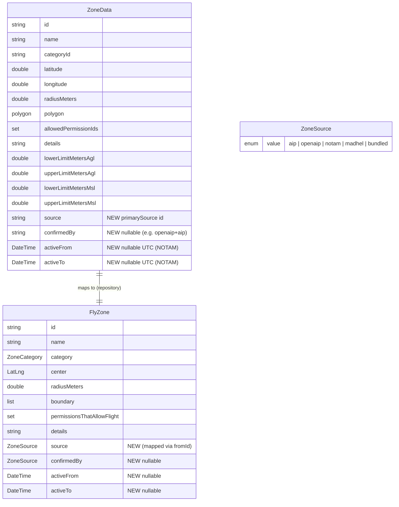

# feat: complete, authoritative airspace zone coverage

## Summary

Make the app's airspace zones **complete and authoritatively sourced** for
drones/RPAS in Argentina. Today the feed has ~694 zones but only 12 exact AIP
polygons; the ~85 ANAC AIP **ENR 5.1** Prohibited/Restricted/Danger areas (plus
ENR 5.5 sporting sectors) are largely absent — the central gap. We treat **ANAC
AIP as the authoritative inventory**, **OpenAIP as the geometry baseline** where
it already covers a zone, fill the remaining gaps via the existing curated
parser (now driven by a semi-automated PDF extraction), **dedup across sources**
so each real zone appears once, add **per-zone provenance**, ingest **time-bounded
NOTAM zones**, and **filter zones by altitude** so high-flight-level restrictions
that never constrain a sub-122 m drone don't read as blocking.

This plan owns **data completeness and sourcing**. The verdict's
confidence/uncertainty *UX* (allowed/conditional/blocked/uncertain, staleness
rendering) is owned by the sibling
[`2026-06-17-airspace-verdict-accuracy`](../brainstorm/2026-06-17-airspace-verdict-accuracy-brainstorm-doc.md)
effort; this plan defines the **typed signals it hands off** (e.g.
`notamSnapshotStale`, `notamUnavailable`) but does not redesign that UX.

## Goals / Non-goals

**Goals**
- Every published ANAC AIP ENR 5.1 (P/R/D) + ENR 5.5 zone that can constrain a
  drone is present in the feed, sourced authoritatively.
- A zone present in two sources renders **once**, with OpenAIP geometry + AIP
  authority.
- Temporary (NOTAM) restrictions appear as time-bounded zones, cached offline
  with their own freshness contract.
- Each zone carries typed provenance; NOTAM zones always read as "temporary."
- AIP authoritative set ships in the **offline bundled snapshot**.

**Non-goals**
- Synthetic behavioral-rule geometry (no-fly-over-crowds, urban agglomeration):
  out of scope as map zones (per brainstorm decision).
- Aerodrome 5 km / 43 m buffers as drawn geometry: deferred (see Open Decision 6).
- The verdict confidence/uncertainty UX redesign: sibling effort.
- Real national-park boundary polygons: out of scope here (keep current circles;
  see Open Decision 5).

## Research basis

Confirmed by the 2026-06-18 spikes (recorded in the brainstorm "Research
Findings"); the durable facts are in memory:
[`anac-aip-airspace-sources`], [`anac-drone-regulatory-framework`],
[`anac-notam-feed`].

- **No structured AIP** (no AIXM/eAIP/GML). ENR 5 PDFs are **text** PDFs →
  `pdftotext -layout` extracts designators + DMS coords → semi-automatable.
- **ENR 5.1 inventory = 85 zones** (18 `SAP` prohibited, 66 `SAR` restricted, 1
  `SAD` danger). `SA` prefix, non-contiguous numbering.
- **Current reg framework = Res. ANAC 550/2025** (RAAC Parte 100/101/102), not
  the 2019–2020 resolutions still referenced in the codebase.
- **Vertical limits decisive**: many ENR 5.1 zones are based at flight levels
  that never constrain a sub-122 m drone.
- **NOTAM endpoint** (free, no-auth, CORS-open):
  `POST https://ais.anac.gob.ar/notam/pib` body `indicador=<code>` → HTML table
  with pre-extracted `Desde:`/`Hasta:` + `COORD GEO`/`RDO` bodies. FIR codes:
  `-EF -CF -VF -MF -RR`.

## Current-state map (verified file paths)

| Concern | File | Note |
|---|---|---|
| Curated AIP zone DB (12) | `tooling/anac_aip_parser/lib/src/zone_database.dart` | Paste-AIP-text `boundaryText` pattern |
| Boundary text parser | `tooling/anac_aip_parser/lib/src/boundary_parser.dart` | DMS coords, arcs, circles, shared FIR/CTR |
| Arc densifier | `tooling/anac_aip_parser/lib/src/arc_densifier.dart` | 0.5° step |
| GeoJSON generator | `tooling/anac_aip_parser/bin/generate_zones.dart` | Emits `source: 'ANAC AIP'` in props (already) |
| AIP output | `backend/data/anac_aip_zones.geojson` | Committed artifact |
| Cross-source validator | `packages/zones_api_client/lib/src/openaip_aip_validator.dart` | Emits `unmatchedOpenAip` / `unmatchedAip` / severity — **gap-analysis engine already exists** |
| Name match keys | `packages/zones_api_client/lib/src/zone_identity.dart` | `ZoneIdentity.matchKey` (used only by validator today) |
| OpenAIP export client | `packages/zones_api_client/lib/src/openaip_export_zones_api_client.dart` | Daily ND-GeoJSON, no key |
| Ingest/merge pipeline | `backend/lib/services/zone_ingest_service.dart` | Merge by **id only**; AIP overrides same id; `_toFeature` drops `source` |
| Zone DTO | `packages/zones_api_client/lib/src/models/zone_data.dart` | No `source`, no validity window |
| Domain model | `packages/flight_rules_repository/lib/src/models/fly_zone.dart` | No `source`, no validity window |
| Runtime dedup | `packages/flight_rules_repository/lib/src/zone_deduplicator.dart` | **id-only** — AIP/OpenAIP won't collapse |
| Assessment | `packages/flight_rules_repository/lib/src/flight_rules_repository.dart` | `zones` vs `skippedByAltitude` per tap |
| Assessment model | `packages/flight_rules_repository/lib/src/models/flight_assessment.dart` | already hints `notamSnapshotStale` reason |
| Map display filter | `lib/map/map_zone_display.dart` | `openAipOnly = true` **hides AIP/MADHEL/curated today** |
| Stale banner | `lib/map/view/widgets/zone_stale_banner.dart` | feed-global 7-day threshold |
| Detail card | `lib/map/view/widgets/zone_detail_card.dart` | per-zone card |
| Data sources page | `lib/settings/view/flight_data_sources_page.dart` | attributions list |

## Architecture decisions

1. **AIP = inventory authority; OpenAIP = geometry baseline.** Merge contract for
   a zone in both: **OpenAIP geometry + AIP-confirmed identity/restriction/limits**,
   single zone, single card. Provenance is modelled as **`primarySource` +
   optional `confirmedBy`** (geometry origin + authority confirmer) — **not** a
   compound `openaip_aip` enum value (would be serialized into the feed JSON and
   hard to migrate; no consumer branches on a combined value).
2. **Cross-source dedup via `ZoneIdentity.matchKey`** lives in **one** reusable
   function in `zones_api_client` (alongside `ZoneIdentity`); both the backend
   `ZoneIngestService` merge step and the repository `ZoneDeduplicator` **delegate
   to it** — no duplicated merge rules across layers. **Safety:** a `matchKey`
   *miss* → keep both (double-render is safer than a disappeared authoritative
   zone; the validator report flags it). A `matchKey` *collision between two
   distinct designators* is a **`matchKey` bug**, caught by a **test over the 85
   known designators** (`zone_identity_test.dart`) — not a runtime guard.
3. **Provenance follows the existing `categoryId` convention.** `ZoneData.source`
   is a **plain `String` sourceId** in the data layer (DTO stays primitive, like
   `categoryId`); the **`ZoneSource` enum + `ZoneSource.fromId` resolver live in
   the repository**, mapped in `_toFlyZone`. A zone may carry `primarySource` +
   nullable `confirmedBy`. The id-prefix heuristics in `ZoneDeduplicator.
   _sourcePriority` and `MapZoneDisplay.isOpenAipZone/isMadhelAerodrome` migrate
   to read the typed source (no two sources of truth).
4. **NOTAM zones are a distinct typed layer** with a **validity window** as flat
   nullable fields **`DateTime? activeFrom` / `DateTime? activeTo` (UTC)** on both
   `ZoneData` and `FlyZone` — *not* `DateTimeRange` (a Flutter `material` type;
   would pull Flutter into the pure-Dart domain package and can't express
   open-ended NOTAMs). Client caches the snapshot with a sync timestamp; "active
   now" evaluated in UTC, displayed in local (ART, UTC−3). Recurrence text is
   **deferred** until a concrete consumer exists (YAGNI).
5. **Altitude relevance is one domain predicate.** Add
   `FlyZone.constrainsAltitudeBelow(ceiling)` (mirroring the existing
   `overlapsAltitudeRange`); **both** the assessment (`skippedByAltitude`) and the
   map render filter call it, so map and card can't disagree. A zone with a
   **known floor above the configurable drone ceiling (~122 m AGL)** is hidden;
   **unknown vertical limits → always shown** (unknown ≠ high). The ceiling
   constant is owned by the **domain**, not presentation.
6. **Offline-first preserved.** AIP set bundles into `BundledZonesApiClient`;
   NOTAM snapshot caches client-side; per-source freshness, not one global banner.
7. **Category fidelity preserved.** `SAD` danger zones keep their true
   `categoryId` (`danger`) in the data layer; any collapse to `restricted` is a
   **display/permission** concern in the repository, so provenance stays faithful.

## Data model changes

`ZoneData` (data DTO) keeps primitive types — `source` is a **String sourceId**
like `categoryId`. The `ZoneSource` enum lives in the **repository**.

## Milestones (each = one independently-mergeable PR)

Revised to 8 PRs after the plan-splitting review (M3 and M5 each split in two).

**Dependency graph:**
`M1 → M2 → M3b`; `M1 → M3a → M3b`; `M1 → M4` (parallel with M2/M3);
`M1 → M5a → M5b`; `M3b + M5b → M6`.
M4, M3a, and M5a can all be authored in parallel once M1 lands.

### M1 — Provenance + validity fields end-to-end (foundation)
**Why first:** every later milestone reasons about `source`/validity.
- Add `String source` (+ nullable `confirmedBy`) and nullable `DateTime
  activeFrom/activeTo` to `ZoneData`; add `ZoneSource` enum + `fromId` in the
  **repository**, map in `_toFlyZone`; add `source`/`confirmedBy`/`activeFrom`/
  `activeTo` to `FlyZone`.
- `zone_ingest_service.dart` `_toFeature` must **write** `source`; every
  `ZoneData(...)` **read** site must parse it. Audit: `grep -rn "ZoneData(" packages/`.
- Migrate `ZoneDeduplicator._sourcePriority` and `MapZoneDisplay.isOpenAipZone/
  isMadhelAerodrome` from id-prefix heuristics to the typed source.
- Tests: serialization round-trip (incl. `source`/validity); ingest sets correct
  source per origin; `_sourcePriority` regression.
- **Files:** `zone_data.dart`, `fly_zone.dart`, `zone_source.dart` (new, repo),
  `flight_rules_repository.dart` (`_toFlyZone`), `zone_ingest_service.dart`,
  `remote_zones_api_client.dart`, `aip_geojson_reader.dart`,
  `bundled_zones_api_client.dart`, madhel/openaip mappers, `map_zone_display.dart`,
  `zone_deduplicator.dart`, `*_test.dart` for each.

### M2 — Cross-source dedup + geometry/authority merge
**Why:** flipping in the full AIP set (M3b) double-renders without this.
**Depends on:** M1.
- Extract a single merge-and-collapse function in `zones_api_client` (alongside
  `ZoneIdentity`); both `ZoneIngestService` and `ZoneDeduplicator` delegate.
  Collapse AIP+OpenAIP matches to one zone: OpenAIP geometry + AIP
  limits/category/permissions, `source = openaip`, `confirmedBy = aip`.
- `matchKey` collision over the 85 designators caught by a **test**
  (`zone_identity_test.dart`), not a runtime guard. `matchKey` miss → keep both.
- Deterministic tap/stacking rule for any residual overlaps.
- **Acceptance:** overlap fixture (EZE / Aeroparque / SAR) → exactly one merged
  zone; `matchKey` test proves no designator collisions.
- **Files:** new merge function in `zones_api_client`, `zone_identity.dart`,
  `zone_deduplicator.dart`, `zone_ingest_service.dart`, tests + overlap fixtures.

### M3a — ENR 5.1/5.5 extraction tooling + inventory reference
**Why:** establishes the authoritative inventory (the human-review gate).
**Depends on:** M1.
- **Extraction tool** under `tooling/anac_aip_parser/bin/extract_enr5.dart`:
  download ENR 5.1/5.5 PDFs from `ais.anac.gob.ar`, `pdftotext -layout`, parse
  designator + DMS + vertical-limit blocks into `AipZoneEntry` candidates.
- Emit the canonical **85-zone inventory** (designators + names) as a checked-in
  `lib/src/enr5_inventory.dart` reference — committed only after spot-check vs PDF.
- Extend `OpenAipAipValidator` to accept the **full inventory** as reference and
  report `unmatchedAip` = the concrete missing-zone list (one-line call-site
  widening + the report).
- **Files:** `bin/extract_enr5.dart`, `lib/src/enr5_inventory.dart`,
  `validate_openaip_zones.dart`, `openaip_aip_validator.dart`, tests.

### M3b — Gap-fill: zone_database entries + regenerated GeoJSON
**Why:** the central completeness deliverable.
**Depends on:** M2 (dedup must precede live flip-in), M3a (inventory).
- Add the missing zones to `zone_database.dart` using the `boundaryText` paste
  pattern (driven by the M3a inventory); regenerate `anac_aip_zones.geojson`.
  `BoundaryParser` already handles DMS/arcs/circles.
- Category/permission mapping: `SAP`→prohibited, `SAR`→restricted,
  `SAD`→**keep `danger` categoryId** (collapse to restricted only at display),
  military vs civil permissions.
- **Acceptance:** validator `unmatchedAip == 0` for drone-relevant zones; every
  ring ≥ 4 vertices; spot-check N zones verbatim vs PDF; no major geometry
  mismatches on spot-checked overlaps.
- **Files:** `zone_database.dart`, `backend/data/anac_aip_zones.geojson`,
  `zone_category.dart` (if `danger` added), tests.

### M4 — Altitude relevance predicate + render filter
**Depends on:** M1. Parallelizable with M2/M3.
- Add `FlyZone.constrainsAltitudeBelow(ceiling)` (domain); ceiling constant owned
  by domain. Both `assessment.skippedByAltitude` and the map render filter call it.
- Hide zones with a **known floor above** the ceiling; **never** filter
  unknown-floor zones. **Delete** the `openAipOnly = true` debug flag.
- **Acceptance:** FL045-floor zone hidden; unknown-floor zone shown; no card/map
  disagreement for the same query.
- **Files:** `fly_zone.dart`, `flight_rules_repository.dart`,
  `map_zone_display.dart`, tests.

### M5a — NOTAM client + parser (data layer)
**Why:** the novel, highest-risk, most test-intensive piece — isolated for review.
**Depends on:** M1 (validity fields).
- New `notam_client.dart`: `POST /notam/pib` per FIR code (`-EF -CF -VF -MF -RR`).
- New `notam_parser.dart`: parse HTML rows → `Desde/Hasta` + `COORD GEO`(+`RDO`)
  → circle/polygon + vertical limits → `ZoneData` with validity. Tolerant regex;
  **un-geocodable → flag/list-only, never silently drop.** Standalone (not wired
  to ingest yet).
- **Acceptance:** real-HTML fixtures parse ≥ the sampled NOTAMs; un-geocodable
  NOTAM surfaces as a list entry.
- **Files:** `notam_client.dart`, `notam_parser.dart`, HTML fixtures, tests.

### M5b — NOTAM merge + cache + freshness signals + UI
**Depends on:** M1, M5a.
- Wire the parser into `ZoneIngestService` (`source = notam` + validity).
- Client-side cache with sync timestamp; **own freshness threshold (~6 h)**;
  refactor `zone_stale_banner.dart` to per-source. NOTAM "temporal" marking on
  the detail card.
- Emit typed signals `notamSnapshotStale` / `notamUnavailable` for the
  verdict-accuracy effort (no verdict rendered here).
- Expired NOTAMs excluded from "active"; future NOTAMs distinct "upcoming."
- **Acceptance:** expired NOTAM excluded from active; offline shows last cache
  with stale signal; signals emitted on stale/unavailable.
- **Files:** `zone_ingest_service.dart`, NOTAM cache, `zone_stale_banner.dart`,
  `zone_detail_card.dart` (temporal marker), `flight_assessment.dart` (signals),
  tests.

### M6 — Attribution surfacing + stale-doc cleanup
**Depends on:** M3b (AIP present), M5b (NOTAM signals).
- AIP trust marker on the detail card (Open Decision 4).
- Add ANAC AIP + EANA NOTAM entries to `flight_data_sources_page.dart` with
  attribution; confirm EANA scrape terms.
- Update codebase/doc references from 2019–2020 resolutions to **Res. 550/2025 +
  311–313/2026**.
- **Files:** `flight_data_sources_page.dart`, `zone_detail_card.dart`, README,
  doc/comment refs.

## Open decisions (defaults chosen; confirm at plan review)

1. **Merge match safety** — *resolved:* `matchKey` miss keeps both (+validator
   flag); collisions caught by a test over the 85 designators, not a runtime guard.
2. **High-altitude / expired display** — *default:* hide known-high-floor zones
   and expired NOTAMs; unknown-floor always shown; future NOTAMs "upcoming."
3. **`SAD` danger category** — *resolved:* keep true `danger` categoryId in the
   data layer; collapse to `restricted` only for display/permission if desired
   (preserves provenance).
4. **Provenance on detail card** — *default:* show "Fuente: ANAC AIP" as a trust
   signal; NOTAM always marked "temporal." Confirm desired prominence.
5. **National parks** — *default:* keep current circles; real boundaries are a
   separate future effort.
6. **Aerodrome 5 km / 43 m buffers** — *default:* not drawn as geometry now
   (verdict text only); revisit if users want it.
7. **NOTAM freshness threshold** — *default:* ~6 h before `notamSnapshotStale`.

## Risks & mitigations

- **PDF parse drift each AIRAC** → extraction tool + checked-in inventory + diff
  on re-scrape; human review gate before commit.
- **Transcription error** → `OpenAipAipValidator` geometry cross-check (area
  ratio + probe points) flags majors; spot-check vs PDF.
- **`matchKey` false collision drops a real zone** → explicit collision guard +
  test (M2).
- **NOTAM free-text variability/typos** → tolerant regex + manual-review fallback;
  cross-check against FAA DINS South America when needed.
- **EANA endpoint is an undocumented scrape** → monitor shape, fixture-based
  tests, attribute, never present as official PIB.
- **Flipping `openAipOnly`/adding AIP changes every user's map** → land behind
  M2 dedup so it doesn't double-render; verify visually.

## Testing strategy

- Unit: model serialization (`source`, validity); `BoundaryParser` on new ENR 5
  text samples; NOTAM parser on real HTML fixtures; dedup overlap + collision.
- Integration: `ZoneIngestService` end-to-end merge with all sources →
  no duplicate real zones, correct `source`, NOTAM validity present.
- Validation: `validate_openaip_zones.dart` against the full inventory →
  `unmatchedAip == 0` (drone-relevant), zero major geometry mismatches on
  spot-checked zones.
- Widget: detail card provenance/temporary marking; altitude-filtered map render;
  per-source stale indicators.

## Acceptance criteria (rollup)

- [ ] All drone-relevant ENR 5.1 (+5.5) zones present; validator `unmatchedAip`
      empty for that set.
- [ ] Zones in AIP+OpenAIP render once (OpenAIP geometry + AIP authority).
- [ ] Each zone has typed `source`; NOTAM zones marked "temporary."
- [ ] NOTAM time-bounded zones ingested; expired hidden; offline cache + own
      freshness; `notamSnapshotStale`/`notamUnavailable` emitted.
- [ ] Known-high-floor zones hidden; unknown-floor zones shown; map ↔ card
      consistent.
- [ ] AIP set ships in the bundled offline snapshot.
- [ ] Data-sources page + docs updated; reg refs → 550/2025.
